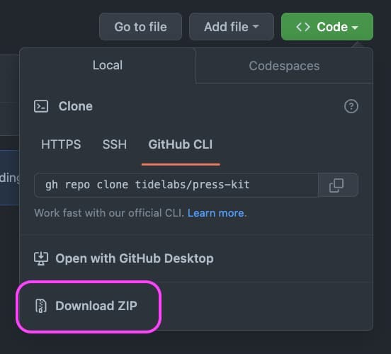

  

# Press Kit

## Logo Guide

Included in this kit are brand guidelines on how to use the logo, such as a color pallette, typography, spacing, etc. There are even examples of how the logo could be cleanly used.

## How to Access Assets

You may choose to navigate to specific assets and download them individually. There is also the option to download this entire press kit source as a ZIP file by clicking on the "〈〉Code ⌄" button and then selecting the "Download ZIP" option (see image).

## License
